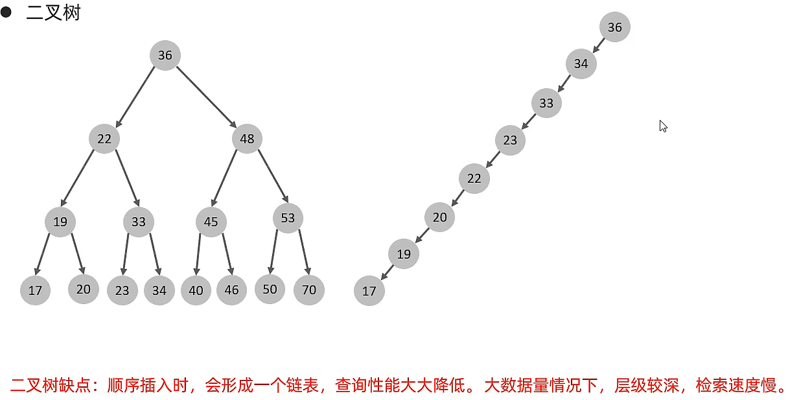
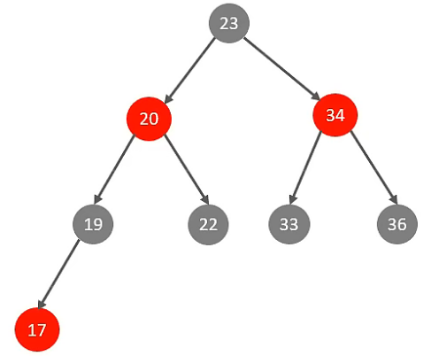
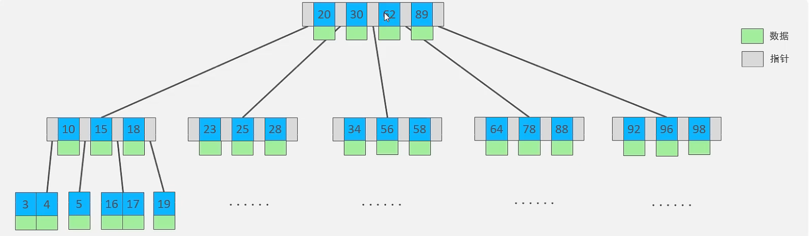
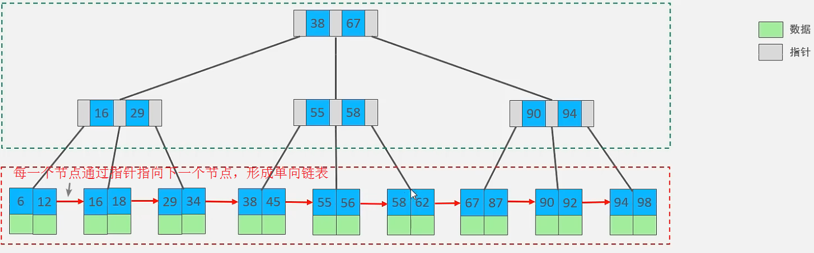
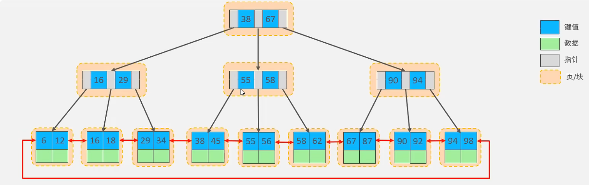

### 存储引擎

存储引擎就是存储数据、建立索引、更新/查询数据等技术的实现方式。存储引擎是基于表而不是基于库的，所以存储引擎也可以被称为表引擎。
默认存储引擎是 InnoDB。

#### InnoDB

InnoDB 是一种兼顾高可靠性和高性能的通用存储引擎，在 MySQL 5.5 之后，InnoDB 是默认的 MySQL 引擎。

特点

- DML 操作遵循 ACID 模型，支持事务
- 行级锁，提高并发访问性能
- 支持外键约束，保证数据的完整性和正确性

文件

- xxx.ibd: xxx 代表表名，InnoDB 引擎的每张表都会对应这样一个表空间文件，存储该表的表结构（frm、sdi）、数据和索引。

### 性能分析

#### 查看执行频次

查看当前数据库的 INSERT, UPDATE, DELETE, SELECT 访问频次：SHOW GLOBAL STATUS LIKE 'Com**\_\_\_**';

#### 慢查询日志

慢查询日志记录了所有执行时间超过指定参数（long_query_time，单位：秒，默认 10 秒）的所有 SQL 语句的日志。
MySQL 的慢查询日志默认没有开启，需要在 MySQL 的配置文件（/etc/my.cnf）中配置如下信息：

- 开启慢查询日志开关

slow_query_log=1

- 设置慢查询日志的时间为 2 秒，SQL 语句执行时间超过 2 秒，就会视为慢查询，记录慢查询日志

long_query_time=2
更改后记得重启 MySQL 服务，日志文件位置：/var/lib/mysql/localhost-slow.log

查看慢查询日志开关状态：
show variables like 'slow_query_log';

#### profile

- show profile 能在做 SQL 优化时帮我们了解时间都耗费在哪里。通过 have_profiling 参数，能看到当前 MySQL 是否支持 profile 操作：
  SELECT @@have_profiling;
- profiling 默认关闭，可以通过 set 语句在 session/global 级别开启 profiling：
  SET profiling = 1;
- 查看所有语句的耗时：
  show profiles;
- 查看指定 query_id 的 SQL 语句各个阶段的耗时：
  show profile for query query_id;
- 查看指定 query_id 的 SQL 语句 CPU 的使用情况
  show profile cpu for query query_id;

#### explain

EXPLAIN 或者 DESC 命令获取 MySQL 如何执行 SELECT 语句的信息，包括在 SELECT 语句执行过程中表如何连接和连接的顺序。

EXPLAIN 各字段含义：

- id：select 查询的序列号，表示查询中执行 select 子句或者操作表的顺序（id 相同，执行顺序从上到下；id 不同，值越大越先执行）
- select_type：表示 SELECT 的类型，常见取值有 SIMPLE（简单表，即不适用表连接或者子查询）、PRIMARY（主查询，即外层的查询）、UNION（UNION 中的第二个或者后面的查询语句）、SUBQUERY（SELECT/WHERE 之后包含了子查询）等
- type：表示连接类型，性能由好到差的连接类型为 NULL、system、const、eq_ref、ref、range、index、all
- possible_key：可能应用在这张表上的索引，一个或多个
- Key：实际使用的索引，如果为 NULL，则没有使用索引
- Key_len：表示索引中使用的字节数，该值为索引字段最大可能长度，并非实际使用长度，在不损失精确性的前提下，长度越短越好
- rows：MySQL 认为必须要执行的行数，在 InnoDB 引擎的表中，是一个估计值，可能并不总是准确的
- filtered：表示返回结果的行数占需读取行数的百分比，filtered 的值越大越好

### 索引

索引是帮助 MySQL 高效获取数据的数据结构（有序）。在数据之外，数据库系统还维护着满足特定查找算法的数据结构，这些数据结构以某种方式引用（指向）数据，这样就可以在这些数据结构上实现高级查询算法，这种数据结构就是索引。

优点:

- 提高数据检索效率，降低数据库的 IO 成本
- 通过索引列对数据进行排序，降低数据排序的成本，降低 CPU 的消耗

缺点：

- 索引列也是要占用空间的
- 索引大大提高了查询效率，但降低了更新的速度，比如 INSERT、UPDATE、DELETE

#### 索引结构

- B+Tree:最常见的索引类型，大部分引擎都支持 B+树索引
- Hash:底层数据结构是用哈希表实现，只有精确匹配索引列的查询才有效，不支持范围查询
- R-Tree(空间索引):空间索引是 MyISAM 引擎的一个特殊索引类型，主要用于地理空间数据类型，通常使用较少
- Full-Text(全文索引):是一种通过建立倒排索引，快速匹配文档的方式，类似于 Lucene, Solr, ES

##### B-Tree

- 二叉树:顺序插入的时候,形成链表,会导致层级变深,查询速度下降
  
- 红黑树:在小数据量的情况下可以优化顺序插入时二叉树的问题,红黑树也存在大数据量情况下，层级较深，检索速度慢的问题。
  
- B-Tree (多路平衡查找树):以一棵最大度数（max-degree，指一个节点的子节点个数）为 5（5 阶）的 b-tree 为例（每个节点最多存储 4 个 key，5 个指针）
  

##### B+Tree


与 B-Tree 的区别：

- 所有的数据都会出现在叶子节点
- 叶子节点形成一个单向链表

MySQL 索引数据结构对经典的 B+Tree 进行了优化。在原 B+Tree 的基础上，增加一个指向相邻叶子节点的链表指针，就形成了带有顺序指针的 B+Tree，提高区间访问的性能


##### hash

哈希索引就是采用一定的 hash 算法，将键值换算成新的 hash 值，映射到对应的槽位上，然后存储在 hash 表中。
如果两个（或多个）键值，映射到一个相同的槽位上，他们就产生了 hash 冲突（也称为 hash 碰撞），可以通过链表来解决。

特点:

- Hash 索引只能用于对等比较（=、in），不支持范围查询（betwwn、>、<、…）
- 无法利用索引完成排序操作
- 查询效率高，通常只需要一次检索就可以了，效率通常要高于 B+Tree 索引

#### 索引分类

- 主键索引:针对于表中主键创建的索引
- 唯一索引:避免同一个表中某数据列中的值重复
- 常规索引:快速定位特定数据
- 全文索引:全文索引查找的是文本中的关键词，而不是比较索引中的值

在 InnoDB 存储引擎中，根据索引的存储形式，又可以分为以下两种：

- 聚集索引(Clustered Index):将数据存储与索引放一块，索引结构的叶子节点保存了行数据,必须有，而且只有一个
- 二级索引(Secondary Index):将数据与索引分开存储，索引结构的叶子节点关联的是对应的主键,可以存在多个

聚集索引选取规则：

- 如果存在主键，主键索引就是聚集索引
- 如果不存在主键，将使用第一个唯一(UNIQUE)索引作为聚集索引
- 如果表没有主键或没有合适的唯一索引，则 InnoDB 会自动生成一个 rowid 作为隐藏的聚集索引

1. 以下 SQL 语句，哪个执行效率高？为什么？

```
select _ from user where id = 10;
select _ from user where name = 'Arm';
-- 备注：id 为主键，name 字段创建的有索引
```

答：第一条语句，因为第二条需要回表查询，相当于两个步骤。

2. InnoDB 主键索引的 B+Tree 高度为多少？

答：假设一行数据大小为 1k，一页中可以存储 16 行这样的数据。InnoDB 的指针占用 6 个字节的空间，主键假设为 bigint，占用字节数为 8.
可得公式：n _ 8 + (n + 1) _ 6 = 16 \* 1024，其中 8 表示 bigint 占用的字节数，n 表示当前节点存储的 key 的数量，(n + 1) 表示指针数量（比 key 多一个）。算出 n 约为 1170。

如果树的高度为 2，那么他能存储的数据量大概为：1171 _ 16 = 18736；
如果树的高度为 3，那么他能存储的数据量大概为：1171 _ 1171 \* 16 = 21939856。

#### 使用规则

##### 最左前缀法则:

如果索引关联了多列（联合索引），要遵守最左前缀法则，最左前缀法则指的是查询从索引的最左列开始，并且不跳过索引中的列。如果跳跃某一列，索引将部分失效（后面的字段索引失效）。

##### 索引失效情况

- 在索引列上进行运算操作，索引将失效。如：explain select \_ from tb_user where substring(phone, 10, 2) = '15';
- 字符串类型字段使用时，不加引号，索引将失效。如：explain select \_ from tb_user where phone = 17799990015;，此处 phone 的值没有加引号
- 模糊查询中，如果仅仅是尾部模糊匹配，索引不会是失效；如果是头部模糊匹配，索引失效。如：explain select \* from tb_user where profession like '%工程';，前后都有 % 也会失效。
- 用 or 分割开的条件，如果 or 其中一个条件的列没有索引，那么涉及的索引都不会被用到。
- 如果 MySQL 评估使用索引比全表更慢，则不使用索引。

##### 覆盖索引&回表查询

如果在聚集索引中直接能找到对应的行，则直接返回行数据，只需要一次查询，哪怕是 select \*；如果在辅助索引中找聚集索引，如 select id, name from xxx where name='xxx';，也只需要通过辅助索引(name)查找到对应的 id，返回 name 和 name 索引对应的 id 即可，只需要一次查询；如果是通过辅助索引查找其他字段，则需要回表查询，如 select id, name, gender from xxx where name='xxx';

所以尽量不要用 select \*，容易出现回表查询，降低效率，除非有联合索引包含了所有字段

##### 前缀索引

当字段类型为字符串（varchar, text 等）时，有时候需要索引很长的字符串，这会让索引变得很大，查询时，浪费大量的磁盘 IO，影响查询效率，此时可以只降字符串的一部分前缀，建立索引，这样可以大大节约索引空间，从而提高索引效率。

##### 单列索引&联合索引

单列索引：即一个索引只包含单个列
联合索引：即一个索引包含了多个列
在业务场景中，如果存在多个查询条件，考虑针对于查询字段建立索引时，建议建立联合索引，而非单列索引。

##### 设计原则

- 针对于数据量较大，且查询比较频繁的表建立索引
- 针对于常作为查询条件（where）、排序（order by）、分组（group by）操作的字段建立索引
- 尽量选择区分度高的列作为索引，尽量建立唯一索引，区分度越高，使用索引的效率越高
- 如果是字符串类型的字段，字段长度较长，可以针对于字段的特点，建立前缀索引
- 尽量使用联合索引，减少单列索引，查询时，联合索引很多时候可以覆盖索引，节省存储空间，避免回表，提高查询效率
- 要控制索引的数量，索引并不是多多益善，索引越多，维护索引结构的代价就越大，会影响增删改的效率
- 如果索引列不能存储 NULL 值，请在创建表时使用 NOT NULL 约束它。当优化器知道每列是否包含 NULL 值时，它可以更好地确定哪个索引最有效地用于查询

### SQL 优化

#### 插入数据

- 普通插入：
  - 采用批量插入（一次插入的数据不建议超过 1000 条）
  - 手动提交事务
  - 主键顺序插入
- 大批量插入：
  - 使用 MySQL 数据库提供的 load 指令插入。

#### 主键优化

- 满足业务需求的情况下，尽量降低主键的长度
- 插入数据时，尽量选择顺序插入，选择使用 AUTO_INCREMENT 自增主键
- 尽量不要使用 UUID 做主键或者是其他的自然主键，如身份证号
- 业务操作时，避免对主键的修改

#### order by

- Using filesort：通过表的索引或全表扫描，读取满足条件的数据行，然后在排序缓冲区 sort buffer 中完成排序操作，所有不是通过索引直接返回排序结果的排序都叫 FileSort 排序
- Using index：通过有序索引顺序扫描直接返回有序数据，这种情况即为 using index，不需要额外排序，操作效率高

总结

- 根据排序字段建立合适的索引，多字段排序时，也遵循最左前缀法则
- 尽量使用覆盖索引
- 多字段排序，一个升序一个降序，此时需要注意联合索引在创建时的规则（ASC/DESC）
- 如果不可避免出现 filesort，大数据量排序时，可以适当增大排序缓冲区大小 sort_buffer_size（默认 256k）

#### group by

- 在分组操作时，可以通过索引来提高效率
- 分组操作时，索引的使用也是满足最左前缀法则的

#### limit 优化

常见的问题如 limit 2000000, 10，此时需要 MySQL 排序前 2000000 条记录，但仅仅返回 2000000 - 2000010 的记录，其他记录丢弃，查询排序的代价非常大。
优化方案：一般分页查询时，通过创建覆盖索引能够比较好地提高性能，可以通过覆盖索引加子查询形式进行优化
`select * from tb_sku as s, (select id from tb_sku order by id limit 9000000, 10) as a where s.id = a.id;
`

#### count 优化

InnoDB 在执行 count(\*) 时，需要把数据一行一行地从引擎里面读出来，然后累计计数。
优化方案：自己计数，如创建 key-value 表存储在内存或硬盘，或者是用 redis
